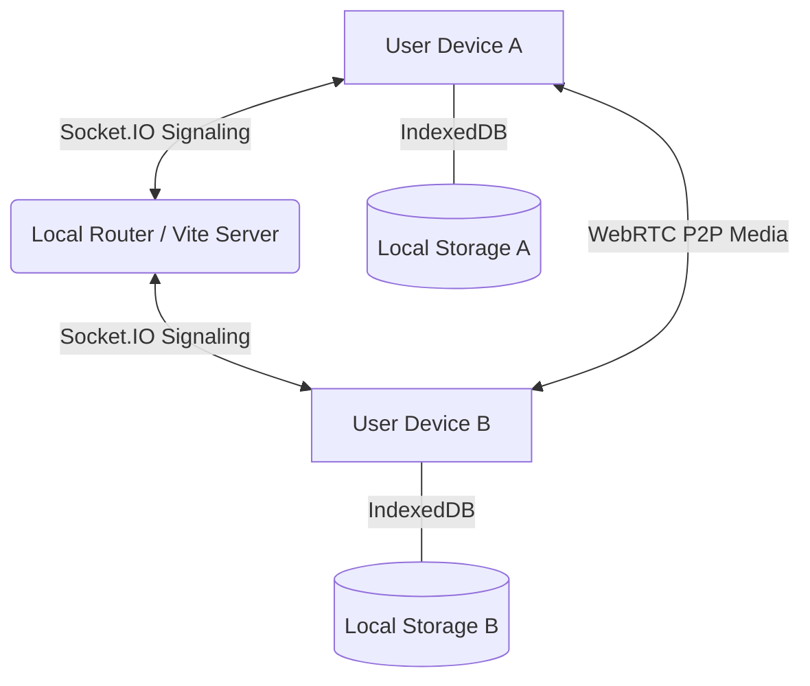

# 🌐 Lorapok LocalSync

**Secure, Serverless, Router-Based Communication for Local Networks.**


Lorapok LocalSync is a high-performance, privacy-focused communication platform designed to work exclusively on your local router's network. No internet required, no external servers, just pure peer-to-peer and local-first interaction.

## ✨ Features

- 🔒 **PIN-Based Security**: Secure your local identity with a 4-digit PIN.
- 🎭 **Anime Avatars**: Choose from 60+ built-in anime and animal DPs (works 100% offline).
- 💬 **Private & Group Messaging**: Real-time communication with local persistent history (IndexedDB).
- 🔑 **Group Secret Keys**: Join private groups instantly using a 6-character unique key.
- 📩 **Private Invitations**: Send direct group invites to your contacts.
- 📞 **HD Voice & Video Calls**: Direct peer-to-peer calls using WebRTC technology.
- 📁 **File Sharing**: Share documents and images directly over your Wi-Fi.
- 🌈 **Glassmorphism UI**: A stunning, premium dark-mode interface.

## 🚀 Getting Started

### Prerequisites
- Node.js (v18+)
- Both devices must be on the same Wi-Fi/Router.

### Installation

1. **Clone the repository**
   ```bash
   git clone https://github.com/Maijied/Lorapok-LocalSync.git
   cd Lorapok-LocalSync
   ```

2. **Install Dependencies**
   ```bash
   npm install
   cd frontend && npm install
   cd ../backend && npm install
   ```

3. **Generate Offline Avatars**
   ```bash
   cd backend
   node generateAvatars.mjs
   ```

4. **Run the App**
   ```bash
   # From the root directory
   npm run dev
   ```

5. **Access the App**
   - On the host machine: `http://localhost:5173`
   - On other devices (Phone/Tablet): Find your host's local IP (e.g., `http://192.168.0.219:5173`)

## 🛠️ Architecture



## 🤝 Contributing

Contributions are welcome! Feel free to open issues or submit pull requests to enhance the LocalSync experience.

## 📝 License

This project is licensed under the MIT License.

---
Built with ❤️ for decentralized communication.
