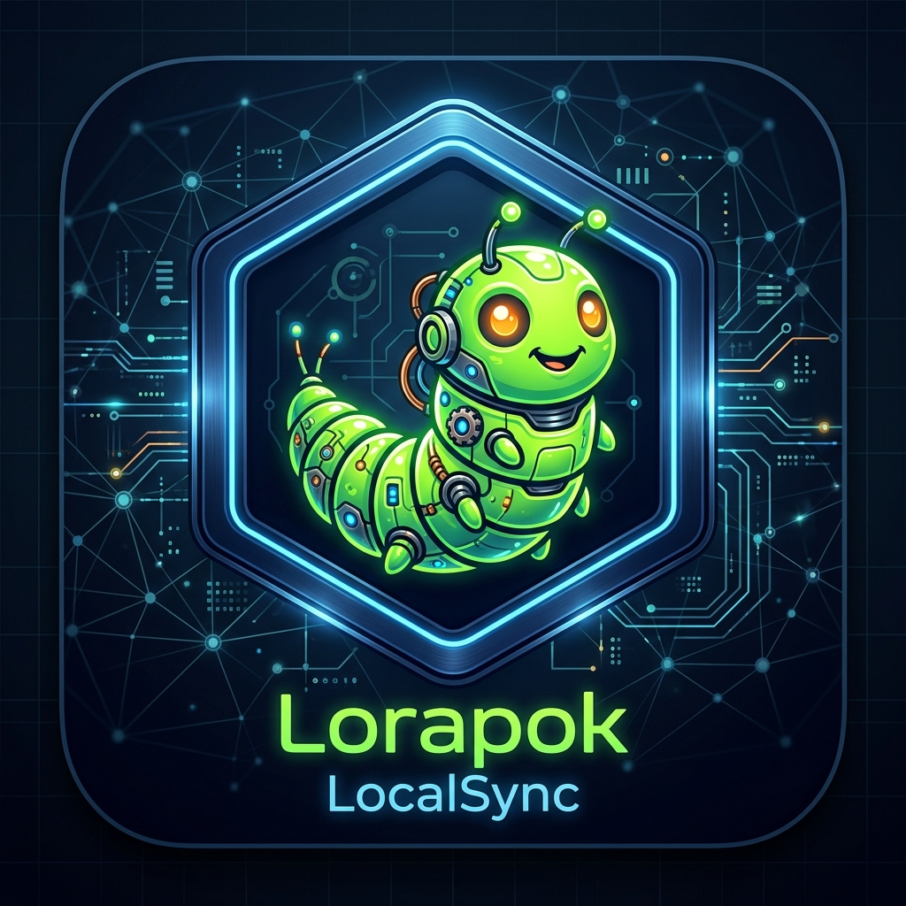

# 📶 Lorapok LocalSync
### High-Performance, Privacy-First Local Network Ecosystem

<p align="center">
  
</p>

<p align="center">
  <a href="https://github.com/Maijied/Lorapok-LocalSync/releases">
    
  </a>
  <a href="https://github.com/Maijied/Lorapok-LocalSync/actions">
    
  </a>
  <a href="LICENSE">
    
  </a>
</p>

**Lorapok LocalSync** is a professional-grade communication suite designed for environments where privacy, speed, and reliability are paramount. It transforms your local Wi-Fi router into a powerful, secure messaging hub. **No internet, no external servers, no tracking.** Just pure, encrypted synchronization between your devices.

---

## ✨ Premium Features

- **🌐 Dynamic Network Discovery**: No more hardcoded IPs. The system automatically identifies the host on your router, allowing seamless cross-platform communication between Windows, Linux, Android, and Web clients.
- **🛡️ Root Identity Protocol**: Automatically identifies users based on their system hostname, ensuring zero-configuration setup for office and home environments.
- **🔐 Cyber-Industrial Security**: AES-256-GCM encryption with secure PIN-based session unlocking and local-only data persistence.
- **📦 Multi-Media Engine**: 
    - **Ultra-Fast Sharing**: Native file streaming for high-quality images and 4K video.
    - **Link Previews**: Rich, automated metadata cards for shared internal and external URLs.
    - **Glassmorphic Viewer**: A stunning, centered media viewer with native video playback controls.
- **📞 HD P2P Calling**: Secure, low-latency voice and video communication powered by WebRTC.
- **🔄 Universal Sync**: Real-time message queuing and delivery status across the entire local network.

---

## 💻 Supported Platforms

| Windows (NSIS) | Linux (.deb/.AppImage) | Android (.apk) | Web App (PWA) |
| :---: | :---: | :---: | :---: |
| ✅ | ✅ | ✅ | ✅ |

---

## 🛠️ Technology Stack

- **Frontend**: React 19, Vite 6, Lucide Icons
- **Backend**: Node.js, Express, Socket.io, SQLite
- **Desktop**: Electron 33 (with Neon Splash Screen & NSIS)
- **Mobile**: Capacitor 6 (Android/iOS)
- **Database**: IndexedDB (Client) & Better-SQLite3 (Server)

---

## 📥 Installation & Usage

### 1. Desktop Users (Windows / Linux / macOS)
With the new **Decentralized Hub Architecture**, there is zero configuration required:
1. Download and install the app from the [Releases Page](https://github.com/Maijied/Lorapok-LocalSync/releases).
2. **Just Open the App**: It will automatically search your local network for an active Hub.
3. **Auto-Hosting**: If it doesn't find a Hub, your PC will seamlessly become the Hub in the background.

### 2. Web Users (Browser)
If a PC on your network is running the Lorapok Desktop App:
1. Find that PC's local IP address (e.g., `192.168.1.15`).
2. Open your browser and go to `http://[THAT-IP]:5173`.
3. The web app will automatically connect to the Hub without needing any extra setup.

### 3. Mobile Users (Android)
Ensure your phone is on the same Wi-Fi router as your PC:
1. Install the APK from the [Releases Page](https://github.com/Maijied/Lorapok-LocalSync/releases).
2. The app will automatically connect to the Desktop Hub.

---

## 🗑️ How to Completely Remove from Ubuntu

If you need to uninstall Lorapok LocalSync and completely wipe your data on Ubuntu:

### 1. Remove the Software
If you installed the `.deb` package:
```bash
sudo apt remove --purge lorapok-localsync
sudo apt autoremove
```

If you used the **AppImage**:
```bash
rm ~/Downloads/Lorapok-LocalSync*.AppImage
rm ~/.local/share/applications/lorapok*.desktop
```

### 2. Wipe Local Data & History (Important)
To remove all your chat history, secret keys, and preferences:
```bash
rm -rf ~/.config/"Lorapok LocalSync"
rm -rf ~/.local/share/"Lorapok LocalSync"
```

---

## 💻 For Developers

1. **Clone & Initialize**:
   ```bash
   git clone https://github.com/Maijied/Lorapok-LocalSync.git
   cd Lorapok-LocalSync
   ```

2. **Start the Development Environment**:
   *The desktop app will automatically fork the backend.*
   ```bash
   cd frontend
   npm install
   npm run electron:dev
   ```

---

## 🛡️ Security & Privacy Architecture

Lorapok follows a **Zero-Trust Local Network** model:
1. **Air-Gapped by Design**: The core application logic never attempts to connect to the global internet.
2. **Local Sovereignty**: All cryptographic keys, messages, and files reside exclusively on your own hardware.
3. **Encrypted Persistence**: Data is stored in encrypted SQLite databases on the server and secured IndexedDB on the client.

---

## 🤝 Contributing

We welcome contributions from the community!
1. Fork the Project.
2. Create your Feature Branch (`git checkout -b feature/AmazingFeature`).
3. Commit your Changes (`git commit -m 'Add some AmazingFeature'`).
4. Push to the Branch (`git push origin feature/AmazingFeature`).
5. Open a Pull Request.

---

## 📄 License

Distributed under the MIT License. See `LICENSE` for more information.

<p align="center">
  Built with ❤️ for the decentralized future.
</p>
