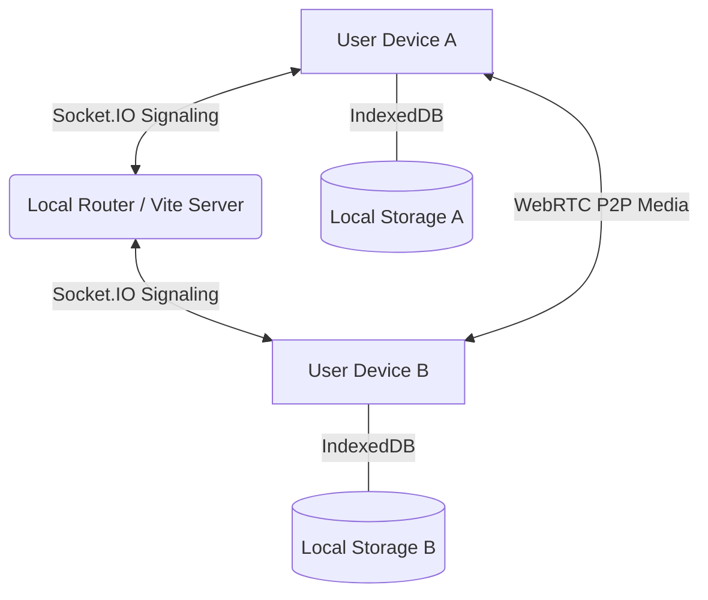

# 🌐 Lorapok LocalSync

**Secure, Serverless, Router-Based Communication for Local Networks.**

Lorapok LocalSync is a high-performance, privacy-focused communication platform designed to work exclusively on your local router's network. No internet required, no external servers, just pure peer-to-peer and local-first interaction.

## ✨ Features

- 🔒 **PIN-Based Security**: Secure your local identity with a 4-digit PIN.
- 🎭 **Anime Avatars**: Choose from 60+ built-in anime and animal DPs (works 100% offline).
- 💬 **Private & Group Messaging**: Real-time communication with local persistent history (IndexedDB).
- 🔑 **Group Secret Keys**: Join private groups instantly using a 6-character unique key.
- 📩 **Private Invitations**: Send direct group invites to your contacts.
- 📞 **HD Voice & Video Calls**: Direct peer-to-peer calls using WebRTC technology.
- 📁 **File Sharing**: Share documents and images directly over your Wi-Fi.
- 🌈 **Glassmorphism UI**: A stunning, premium dark-mode interface.
- 📱 **Mobile Responsive**: Perfect experience on iOS and Android browsers.

## 🚀 One-Click Installation

### Windows
1. Double-click **`install.bat`**
2. Wait for the success message.
3. Choose **`y`** to start the app instantly!

### Linux & macOS
1. Open terminal in the project folder.
2. Run **`bash install.sh`**
3. Choose **`y`** to start the app instantly!

## 📖 How to Use

1. **Host Setup**: Start the app on your main PC using `npm run dev`.
2. **Access**: Open `http://localhost:5173` on the host.
3. **Mobile Connection**: 
   - Find your PC's Local IP (e.g., `192.168.0.219`).
   - Open `http://192.168.0.219:5173` on your phone.
   - *Tip: Click the **Help (?)** icon in the dashboard for a full visual guide.*

## 🛠️ Architecture

## 🧪 CI/CD
This project uses **GitHub Actions** to automatically deploy the official landing page to GitHub Pages whenever changes are made to the `docs/` folder.

---
Built with ❤️ for decentralized communication.  
**Official Site:** [https://maijied.github.io/Lorapok-LocalSync/](https://maijied.github.io/Lorapok-LocalSync/)
